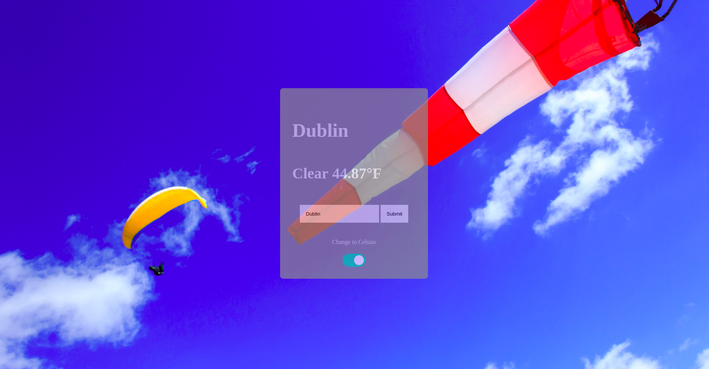

# Weather App
The aim of this project was to create a weather app where users can input a city and view the weather type and temperature of that city. The original project requirements can be found on [The Odin Project](https://www.theodinproject.com/courses/javascript/lessons/weather-app).



This app uses the OpenWeatherMap API which can be found [here](https://openweathermap.org/current).

### Live Link
To view the live link, [click here](https://rawcdn.githack.com/evaveskova/weather_app/ecffe243249ba9cf81392a69c195cd32363d5b98/dist/index.html).

### Technologies Used
* JavaScript
* HTML
* CSS
* Webpack

### 👤 Author

* Github: [@evaveskova](https://github.com/evaveskova)
* Linkedin: [Eva Veskova Jackson](https://www.linkedin.com/in/evaveskova/)

### How to Use
* Visit the live link or clone the project in the terminal by running
```
git clone
```
* If webpage is cloned, open index.html.
* Input a city in the form and submit to view the weather.

### 🤝 Contributing

Contributions, issues and feature requests are welcome!

### Show your support

Give a ⭐️ if you like this project!

### 📝 License

This project is [MIT](lic.url) licensed.
